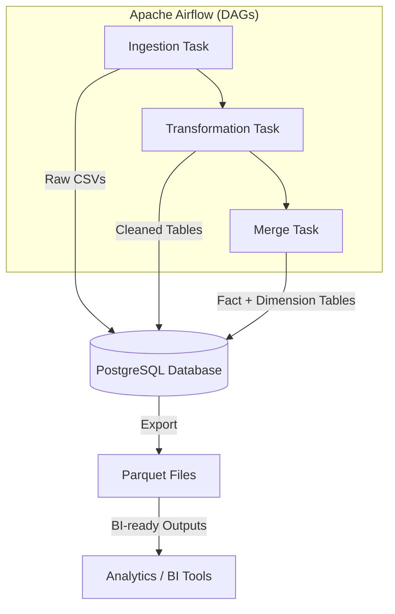
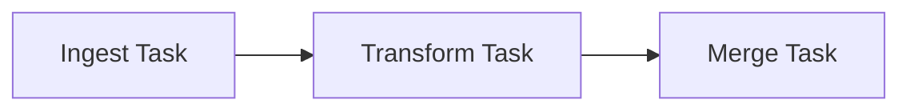

# Olist Data Pipeline with Airflow

## 📌 Project Overview
This project implements a **production‑grade data engineering pipeline** for the Olist e‑commerce dataset.  
It simulates a real company workflow by orchestrating ingestion, transformation, and merging tasks using **Apache Airflow inside Docker**.

The pipeline outputs clean, scalable datasets in **Parquet format**, following a **star schema design** suitable for BI and analytics.

---

## ⚙️ Architecture
- **Airflow DAGs** orchestrate the workflow:
  - **Ingestion** → load raw CSVs into Postgres
  - **Transformation** → clean and normalize tables
  - **Merge** → build fact table with joins to dimension tables
- **Docker Compose** manages Airflow, Postgres, Redis, and supporting services
- **Postgres** used as the warehouse for joins
- **Parquet** used for efficient, columnar storage

---
## 🏗️ Architecture Diagram


---

## 📊 DAG Workflow (Task Dependencies)



---

## 📂 Repository Structure

```text
.
├── dags/                  # Airflow DAG definitions (ETL orchestration)
├── scripts/               # Python scripts (ingest, transform, merge)
├── config/                # Config files for pipeline
├── datasets/              # Original source data (Kaggle datasets)(ignored in .gitignore)
├── data/                  # Pipeline data storage (ignored in .gitignore)
│   ├── raw/               # Extracted / Ingested data
│   ├── processed/         # Cleaned and transformed data
│   └── merged/            # Final joined datasets for analysis
├── logs/                  # Airflow execution logs (ignored in .gitignore)
├── .gitignore             # Files and folders excluded from Git
├── docker-compose.yaml    # Container orchestration for Airflow
└── README.md              # Project documentation
```
---

## 🚀 Pipeline Workflow
1. **Ingestion**
   - Reads raw CSVs from `/data`
   - Loads into SQLite tables
   - Logs row counts for validation

2. **Transformation**
   - Cleans column names
   - Normalizes data types
   - Prepares dimension tables

3. **Merge**
   - Joins fact table (`orders`) with dimensions (`customers`, `items`, `payments`, `reviews`)
   - Prefixes dimension columns to avoid duplicates
   - Saves outputs as CSV + Parquet

---

## 🧪 Data Quality Checks
- Row counts logged at each stage
- Duplicate column names handled during merge
- Parquet schema enforced for consistency

---

## 🛠️ Tech Stack
- **Python 3.8**
- **Apache Airflow 2.8**
- **Docker + Docker Compose**
- **Postgres**
- **Pandas + PyArrow**

---

## 📊 Example Outputs
- `fact_orders.csv` → merged fact table
- `fact_orders.parquet` → optimized columnar storage
- Dimension tables available in Postgres for BI queries

---


## 🚀 Usage Guide

Follow these steps to set up and run the pipeline locally:

### 1. Clone the Repository
```bash
git clone https://github.com/<your-username>/olist-data-pipeline.git
cd olist-data-pipeline
```
### 2. Set Up Environment Variables
Copy the example environment file:

```bash
cp .env.example .env
```
Adjust values in .env as needed (e.g., AIRFLOW_UID=50000).

### 3. Start Airflow with Docker Compose
```bash
docker-compose up -d
```
This will spin up the Airflow webserver, scheduler, Postgres, Redis, and supporting services.

### 4. Access the Airflow UI
- Open your browser and go to:
[Airflow UI](http://localhost:8081)
- Log in with the credentials defined in your .env file (default: airflow/airflow).

### 5. Trigger the Pipeline DAG
- In the Airflow UI, locate the DAG (e.g., retail_pipeline).
- Trigger it manually or let the scheduler run it automatically.

### 6. Check Outputs
- Raw data → stored in data/raw/
- Processed tables → stored in data/processed/
- Merged fact table → stored in data/merged/ as both CSV and Parquet

### 7. Logs and Monitoring
- Airflow execution logs are stored in logs/ (ignored in Git).
- DAG run details are visible in the Airflow UI.

---

## 🎯 Key Learnings
- Orchestration: Airflow DAGs simulate enterprise workflows
- Scalability: Parquet format ensures efficient storage
- Schema design: Star schema makes BI queries straightforward
- Professional setup: Dockerized environment with reproducible configs

---

## 📈 Future Improvements
- Add unit tests for scripts
- Integrate with cloud storage (S3, GCS)
- Replace Postgres with BigQuery or Snowflake
- Add monitoring dashboards
- Parallelize transformations in DAG
---